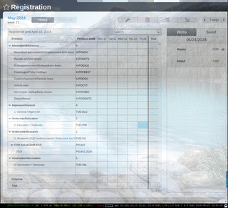

# Teach-Me-Human

Simple tool to automate processes that cannot be automated with API.
Teach the system how to fill in a form or click a certain button and play it
back later.


## Installation

```bash
pip install .
```

## Usage

Teach mouse behavior to the system by recording it.
```bash
teachmehuman <recordprefix>
```
Press `Space` to start recording and `Esc` to stop recording.

Convert it to a simple python function.

```bash
rec2py <list-of-json-files>
```

You can now use the generated python function to automate the process.

## Examples

Video of hour registration automation as gif:


